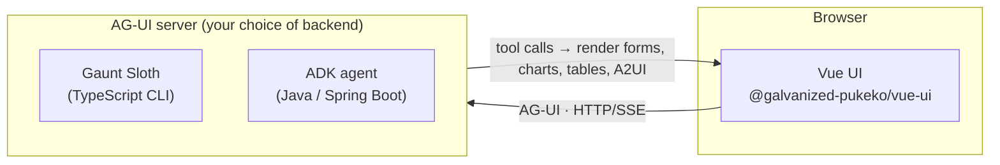

# Galvanized Pukeko

[](https://vuejs.org/)
[](https://www.npmjs.com/package/@galvanized-pukeko/vue-ui)
[](https://github.com/ag-ui-protocol/ag-ui)
[-blue.svg)](https://openjdk.org/)
[](LICENSE)

**Give your LLM agent a real UI.** Instead of replying with text only, the agent renders forms,
charts, tables and interactive [A2UI](https://github.com/google/A2UI) surfaces — and reads back what
the user does with them. The UI is a Vue 3 component library that talks to any
[AG-UI](https://github.com/ag-ui-protocol/ag-ui) server.


## Start here: the Vue UI

The heart of the project is **[`@galvanized-pukeko/vue-ui`](https://www.npmjs.com/package/@galvanized-pukeko/vue-ui)** —
a Vue 3 library that renders the chat interface plus the components an agent asks for.

```bash
npm install @galvanized-pukeko/vue-ui vue
```

```ts
import '@galvanized-pukeko/vue-ui/style.css'
import { createApp } from 'vue'
import { CoreApp, configService } from '@galvanized-pukeko/vue-ui'

await configService.load()
createApp(CoreApp).mount('#app')
```

Point it at any AG-UI server and the agent can render UI right in the conversation. See the docs:

- [Getting started](packages/galvanized-pukeko-vue-ui/docs/getting-started.md)
- [Configuration](packages/galvanized-pukeko-vue-ui/docs/configuration.md)
- [Components & API reference](packages/galvanized-pukeko-vue-ui/docs/components.md)

> **In the wild:** the [Pukeko robot controller](https://github.com/andruhon/pukeko-robot-controller)
> drives a physical robot through the Vue UI — the agent calls browser-side *client tools*
> (camera, motion) and reads the results back.

## How it works



The Vue UI is backend-agnostic — any AG-UI server works. This repo ships two: the npm-based
**Gaunt Sloth** CLI and a Java/Spring **ADK agent**.

## Packages

| Package | Description |
|---------|-------------|
| **[`galvanized-pukeko-vue-ui`](packages/galvanized-pukeko-vue-ui/)** | **The Vue 3 UI library** — chat interface, forms, charts, tables, A2UI surfaces. Published on [npm](https://www.npmjs.com/package/@galvanized-pukeko/vue-ui). [Docs](packages/galvanized-pukeko-vue-ui/docs). |
| [`galvanized-pukeko-web-client`](packages/galvanized-pukeko-web-client/) | Thin host app that mounts the Vue UI — the dev server, and the build embedded by the ADK agent. Not published. |
| [`galvanized-pukeko-agent-adk`](packages/galvanized-pukeko-agent-adk/) | One backend option: a Spring Boot / Google ADK agent with UI-rendering tools, MCP and A2A. On [Maven Central](https://central.sonatype.com/artifact/io.github.galvanized-pukeko/galvanized-pukeko-agent-adk). See its [README](packages/galvanized-pukeko-agent-adk/README.md). |

[Gaunt Sloth](https://github.com/pukeko-robotics/gaunt-sloth) — a separate TypeScript CLI —
is the other supported AG-UI backend.

## Run a demo

Prerequisites: Node.js 24+. (The ADK backend additionally needs Java 17+; Maven is bundled via `./mvnw`.)

**Option 1 — Gaunt Sloth backend (Node only):**

```bash
pnpm install
pnpm run start-gth-ag-ui   # AG-UI server on :3000 + web client on :5555
```

**Option 2 — ADK agent (Java):**

```bash
pnpm install
pnpm run start-adk         # ADK agent on :8080 + web client on :5555
```

See the [ADK README](packages/galvanized-pukeko-agent-adk/README.md) for ADK setup, models, MCP/A2A
and Cloud Run deployment.

Then open `http://localhost:5555` and try:

- `"Show me a contact form"` — renders a form
- `"Show me a chart of month lengths"` — renders a chart
- `"Show me a table of suppliers"` — renders a table

More end-to-end setups live in [examples/](examples/).

## Testing

End-to-end tests use [Playwright](https://playwright.dev/); the runners start the services for you:

```bash
pnpm run it-gth-ag-ui   # Gaunt Sloth backend
pnpm run it-adk         # ADK backend (add it-adk-headed for a visible browser)
```

If Playwright reports the browser is missing, run `npx playwright install`.

## Contributing

Contributions are welcome — see [CONTRIBUTING.md](CONTRIBUTING.md).

## Related

- [`@galvanized-pukeko/vue-ui` on npm](https://www.npmjs.com/package/@galvanized-pukeko/vue-ui)
- [Pukeko robot controller](https://github.com/andruhon/pukeko-robot-controller) — reference implementation using client tools
- [AG-UI protocol](https://github.com/ag-ui-protocol/ag-ui)
- [A2UI](https://github.com/google/A2UI)
- [Gaunt Sloth assistant](https://github.com/pukeko-robotics/gaunt-sloth)
- [Google ADK (Agent Development Kit)](https://github.com/google/adk-java)

## License

Released under the [MIT License](LICENSE) © Andrew Kondratev.

The `galvanized-pukeko-agent-adk` package is a separate, optional backend licensed under
[Apache License 2.0](packages/galvanized-pukeko-agent-adk/LICENSE).
